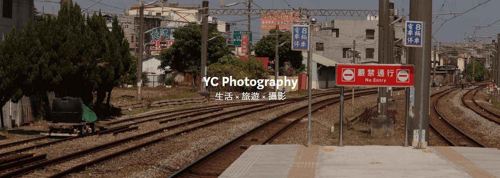

## 關於油成
這裡是 yc 油成 的部落格，你可以前往油成的[個人網站](https://imych.one)了解更多有關我的資訊！

## 關於授權
本站的內容大多採用 [CC BY-NC-SA 4.0](https://creativecommons.org/licenses/by-nc-sa/4.0/) 授權，這意味著：
- 你可以自由分享和改編這些內容，但必須給予適當的署名，並且不能用於商業用途。
- 如果你修改了內容，必須在相同的條件下分享。

## 交換連結
如果你想要交換連結或合作，歡迎[透過 Email 與我聯絡](https://imych.one/)。

- [유유유 的礦場](https://e-xin-o.netlify.app/%E9%97%9C%E6%96%BC/) 這位地質學家想舔大理岩
- [圓州率](https://jinzhou.netlify.app/) 一個立志成為科學家的故事