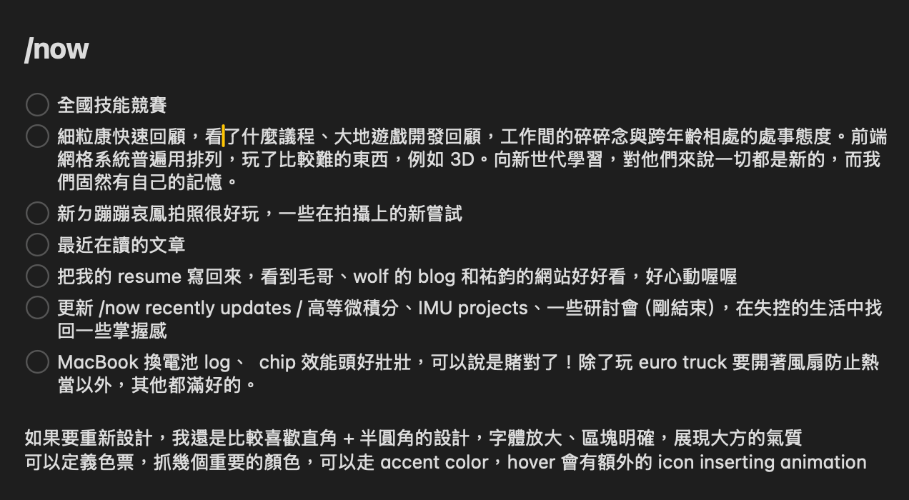



這是一個高雄的午後，現在坐在高雄車站的室外花園上敲這篇近況，高雄的蚊子真的非常的多，這次的清明連假還下爆暴雨， ~~杜牧，這就是你所謂的「清明時節雨紛紛」嗎？~~

[/Now page](/now) 是個新的系列，有別於部落格單篇完整的文章，這會比較偏向稍微整理過的流水帳，用來分享我近期在做的事情，讓讀者了解我目前的生活狀態和工作重點。

其實大約在 9 個月前就開了，只不過生活中一直好忙好忙，完美主義的我也會因此容易想著，要把 /now page 打理到多好多好，開始前不免還會想看一下朋友們的版上都怎麼寫的，才願意開始寫作。想了這麼多，不如挪點時間讓自己輸出，開始來寫吧！

<!-- more -->

# 夏日大作戰 4K 重製版

昨天去看了夏日大作戰重製版，不得不說在電影院裡好有身歷其境的感覺。小時候看可能只注意到 OZ.net 世界的魅力，長大後（好啦就是現在）才注意到了好多以前都沒有注意過的細節。

## 東京實景

去過東京後，對於劇中來自現實取景的場景熟悉很多，例如搭乘「中央總武線」去「新宿車站」搭新幹線，電車上的小螢幕正播放著 OZ 世界「佳主馬」戰鬥的實況，而等待新幹線那邊的月台是半露天的。



## 感動的 moment

最有感觸的是尾聲老奶奶過世到搬冰塊 fighting 這段，我認為這才是這部片的正片。這段敘述了大家庭所展現出的濃厚情感，四散在各行各業的家庭成員們，合力於拯救人命的鬥志。

長大後才能理解，組織大家庭是件多麼不容易的事；題外話，陣內家的組合放在華人社會來說，根本是菁英家庭吧！當時沈浸在大銀幕前超級催淚，好多 moment 都想抓著同行的朋爆哭一番😭。

## 日美關係

我注意到劇情中還有個滿有趣的安排，Love Machine AI 由美國軍方取得並測試後，在日本廣泛使用的虛擬網路平台 OZ 失控，癱瘓行政與交通等基礎設施，甚至操控導彈攻擊全球核電廠，形成兩大國對峙氛圍。

此設定反映 2009 近十年間日美戰略轉變，從過去美軍直接佔領日本本土，演變為透過 OZ 等平台與演算法，將日本乃至全球基礎設施納入同一控制座標，猶如數位版的帝國延伸。

侘助出售家族土地資金開發此 AI，並當著奶奶面揭露其被美軍採用，最終導致國家混亂，諷刺日本郵政民營化等經濟改革釋放資金進入全球市場，卻使技術與美軍深度耦合。日本地方陣內家族集結收拾後果，宛如 2009 年民主黨上台後普天間基地危機，象徵基層對全球科技權力過度集中後果的反彈與韌性，而非單純反美寓言。

> 以上是主觀的腦補，請不要當真xd。 
>  FYI: [Gemini Deep Research - 2009 近十年間日美關係深度解析](https://docs.google.com/document/d/1d9fAHDdAYV6oSix4A5ev3CHFm7s8nZqCbtFe3o7tDLc/edit?usp=sharing)

拉回現代，其實這也預告了當世界仰賴單一科技公司的服務，該平台是否還能夠維持好自我監管的能力，以及對現實世界的影響。近期世界也發生了一些大規模受影響的事情，TESLA、META、AWS，這些提供商的服務和政策一旦出現問題，影響的範圍擴及全球。如今服務逐漸從「哪個國家」轉變成「哪個平台或基礎設施」，對於地方營運早已無形中掌握太多權力。那我想，這大概就是「現代」吧，我們正在經歷每一刻世界正在發生的變化。

## younger children 雜談

不過回頭想想，資訊社群裡現在好多高中生可能已經不知道這部作品了，連假時問表妹，他也說他沒有聽過，突然有種時代在往前跑的感覺。

同行的友人 O 小我兩歲，他說這部是啟蒙他踏入資訊領域的作品。

- （在電影院裡，O 坐我隔壁）
- 我：欸等一下，你居然看過這部⋯
- O：？什麼意思
- 我：呃就是⋯ the younger children……
- O：白痴喔，我們沒有差這麼多好嗎

> 真的好安慰，原來我們還在同一世代嗎😭

# 一些 todos

這學期也有很多事情要忙，生活、學科、專題、工作、社群聚會，每學期都在學習著從繁忙中找回自己。

其實我有超多想寫的東西，不過這次我選擇慢食，讓自己均衡地將寫作（輸出想法）融入生活中。今天先這樣，我們下次見！

