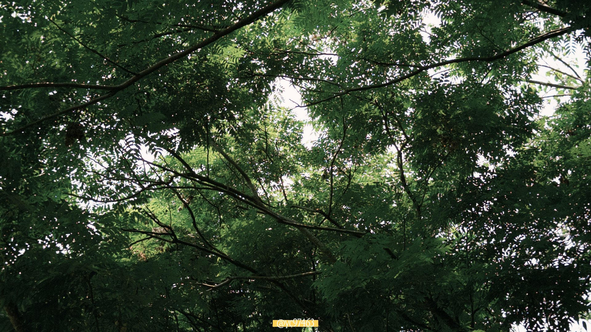
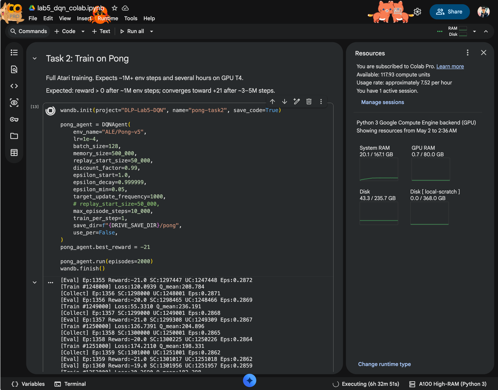
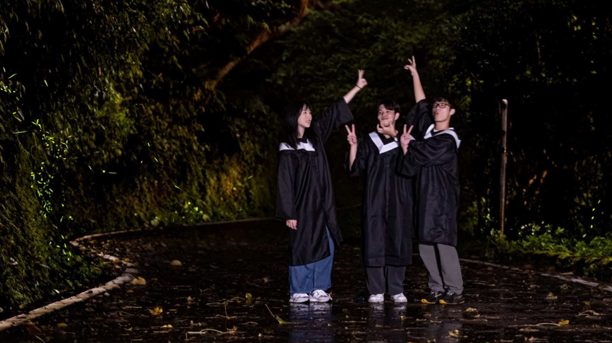

沒想到距離上一次寫 [/now](/now) 竟然時隔一個月，這段期間發生了很多事情，工作上也有不少進展，不過我想先從一個比較輕鬆的話題開始說起。

<!-- more -->

## 期中考週與學習

最近這半年到一年間，算是我自己少數幾次過上真正意義的「期中考生活」。這學期在當一個乖學生，修了高等微積分、高等線性代數、統計學等數學課（我知道，這聽起來快瘋了），想盡辦法讓題目藉由演練，刷進腦袋裡，只是為了在測驗中取得相對好的成績。

這個轉變對我來說滿大的（有種反差感？），從來沒想到我會如此認真地看待「學科」。一部分是因為我注意到了知識與現實世界中的連結，一部分期待突破自己，因為我不認為有我學不會的事情（這是種傲氣！）。

這股勇氣是來自於[高中不怎麼正視學科帶來的價值](/memorable-educator-in-high-school/)時期至今的我，當時熱衷於資訊開發領域的各種技術債與作品，而大學過了過半，我注意到自己主修的課業與某些想精進的技能，學習上好像有很大的阻力，白話文是怎麼樣都學不會，我感到很失落，能用 depressed 來形容。

突然間我想代謝掉以前曾經的自己，因為在看待事物時多少會加入「以經驗來說」的判斷與方式，這讓我在面對這個嶄新的主修科系上，吃了很多的悶虧，身心遭遇到了極大的打擊，畢竟這裡是全新的知識邏輯。我嘗試重新學習面對陌生事物（把自己打掉重練），經過一番演練後，目前得到一些回饋，例如微積分過了、題目看得懂寫得出來，我好像比較不這麼害怕數學科學了（嗎？）。

> 所以我滿推薦，如果你發現你有什麼技能遲遲學不太起來，不妨先放下原有的成見，好好聽聽專業領域的故事，並且反覆演練，時間與力氣會回饋你的努力ㄉ。

如果沒赴約或沒什麼回訊息，那也許是我正在苦惱著以上的事情。

- 題外話 1：隨之出現的生心理影響，痘痘反映著生活作息與壓力，冒了又消，消了又冒。

- 題外話 2：穩定地踏上了身心科處理睡眠與焦慮的問題，不得不說用藥的效果滿好的，用藥後我從來沒睡得如此安穩過，隔天醒來如全新的人一般，帶著穩定的心情面對戰場。我認為這是普遍的現代文明病，在繁忙的日子中還得多多學習與自己相處。

- 題外話 3：數學系的要求還是滿嚴謹（慘忍）的😭，很難逃避，不知道這學期結束前還會為此哭哭幾次。

## 深度學習 hands-on lab

這學期遠距參與 [TAICA 的深度學習](https://taicatw.net/spring-114/) 課程，知識與訓練量很龐大。

寫這篇 now 的當下，我還在跑運算呢。好久zzzzzz

## 資工系畢業專題收尾

參與了資工系的畢業專題，身為遊戲的局外人，兩學期間又大量分配時間在補救我的學分。原訂兩週一次與老師的開會，我只能說以擠爆的「番茄醬工作法」來形容這場災難，近乎在瀕臨榨乾的狀態下過完每一週，真的好累😭。

最後以平均 1 個月一次，每次半小時左右的咪挺、3 次與其他老師合作的咪挺，將手邊的研究與專案開發稍微得出一個結論，當老師在看完研究的比較圖後說：「好像差不多了！報告書寫完也可以順便投期刊了。」的剎那，眼淚都快落下來了。之後有機會再來細談。

## 壽豐螢火蟲季

BJ4，上山去玩。

📸 credit：

## Overview 四月的哩哩扣扣

- 皮克敏：最近在彎道超車邀我室友哈哈，才加入一週不到就跟他同等窮追不捨；我的好友代碼 `4794 8231 6846`，歡迎加好友揪打菇！
- 攀岩課：教到有確保繩索的「先鋒攀登」，真的非常累啊，生理上會同時處理意志力，又得克服手指抓握、體力和技巧。
- 全國技能競賽：比「53 雲端運算」，這是我第一次報技能競賽，很幸運地得了佳作。
- 畢業季：在 Instagram Reels 和 Threads 看到好多高中班帳、畢聯會帳號在進行「畢業倒數」，覺得現在的高中生很新鮮很活網（？）。

## What's next?

Todos

- AIS3 Pre-exam
- 跟老師合作期刊：被追殺稿件中 QQ。
- 資工系畢業專題：專題期末報告書。
- 規劃訪美的行程：好期待 Road trip 與考察美國的道路系統欸！
- 網路程式設計作業與 Demo

行程

- [GIS 國土空間圖資競賽](https://www.giscontest.tw/)：決賽發表，角逐三萬元獎金嘻嘻。
- [g0v Summit 2026](https://summit.g0v.tw/2026/)：我會去當議程助理，第一次以這個身份參與社群。
- [成功大學都市計劃學系115級畢業特展：城市操作手冊](https://www.facebook.com/NCKUUPGE/)：第二次參觀成大都計系學生的畢業展，很渴望也能讀都計系，投射精心巧思在規劃城市上，觀展與聊聊來止些渴。

五月應該也會是很忙的一個月！

## 近期在閱讀的書

- [Urban Bikeway Design Guide](https://nacto.org/publication/urban-bikeway-design-guide/)：近期向圖書館薦購進來，原本以為是歐洲的道路介紹，翻了翻想說怎麼書裡都在談美式的道路設計與實例，結果 NACTO 就是北美城市交通部門的聯盟哈哈哈。
- 問候薛西佛斯：散文，作者花蓮人，年輕時花蓮臺北兩地跑。從他的敘寫連結了不少我在花蓮的記憶、同感年輕視角的「臺北這座大城市」。



---


