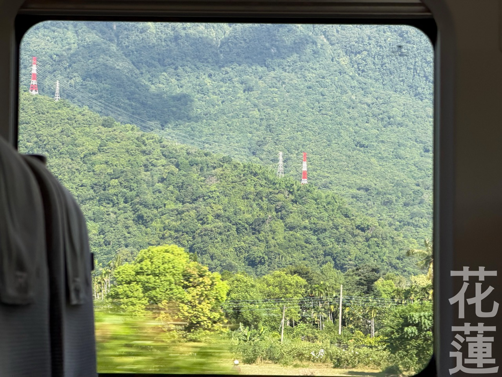

~~好快地來到七月！ /now 已經成為月刊性質了。這個月也有好多事情，大概放了半個月的暑假在高雄。~~

八月啦！這篇原本其實是七月初要寫的，但有點忙不過來，時間咻一下地就到八月了，好快 ORZ。

# 這學期當乖學生

哦，原來當乖學生的感覺是這樣子，既痛苦又享受被凌虐於知識中（好像有點 M），掙扎到解放的那一刻得到解脫。

最後剩 25~32 學分，加油加油。

# 重新思考與人的關係

跟心理諮商師聊了好多，才逐漸意識到曾經的經歷是「創傷」，現在比較有力氣正視才慢慢走出來，接受這個樣子的自己。覺得只要還願意開始，一切都不晚，沒有開始才只能後悔呢！感謝自己陪自己接納自己，走過那些不愉快。

# 五天環台行程

七月初流行 setlog，我期末完出門玩 5 天，一路上手動錄了 3 秒左右的短片記錄，之後看看有沒有空剪成一部片。

圖上的文字是[蘭陽黑體](https://justfont.com/lanyanghei/)，6/30 開放預購下載，終於等到釋出的這天ㄌ，超開心！

# 轉租記事

要離開原住處了，打算發在學校租屋版上轉租出去，來了一位芬蘭交換學生詢問，當我以為一切都很順利地進行，他請了他在芬蘭教華語的老師（臺灣人）的媽媽（花蓮人）來看房子，結果他媽媽覺得房子不適合他，跟芬蘭人溝通的氣氛完全變調，明顯感覺到亞洲家長介入起手式，他猶豫不決的心，我還以為我的心比較好玩。

# AIS3 2026 新型態資安暑期課程

TL;DR: 交朋友比課程和制度好玩很多，很開心在短短的七天認識了好多不同學校的人，一起揪吃飯、在做專題的時候互相客串關心進度，讓我重新學習跟人的相處，覺得很棒 owo\)////。課程內容領域跨度滿大的，雖然我沒有完全跟上，但還是學到很多之前沒接觸過的知識。



值得一提的是，這次我住新竹朋友的家，借車每天通勤到學校，終於讓我體驗到光復路塞車的盛況啦！主辦規定 9:00 的課，8:30 開始報到，到學校的路上順暢大概抓 10 分鐘，在學校裡停好車走過去大概 10 分鐘，所以我每天大概 7:50 醒來，8:00 第二次醒來，8:10 出門，大約 8:25 抵達停車場，剩下的時間走路去買早餐或先簽到。

結果第二天我有點厭學賴床，拖到 8:20 才出門，結果在光復路上大塞車 TT，8:45 才抵達停車場⋯⋯整體車流明顯擁擠許多，我望著距離前方大約一公里的公車，大概過了兩三輪號誌後，他竟然還在原地！沒想到晚 10 分鐘出門的代價，是將近 20 分鐘塞在路上，差點趕不上簽到，嚇鼠寶寶了。

連續七天 996 雖然很累，但是值得開心的回憶，不知道未來還有沒有機會看到交大的風景xd。

之後有時間再分一篇出來特別紀錄。



# 八月重要事項

- 月底去美國 New York、San Francisco、德州 Road Trip，歡迎與我分享。
- HITCON 出現一下。
- SITCON BoF，今年擔任副召的角色，歡迎來吃吃喝喝聊聊！
- 生 paper 給老師、做備審 TT。