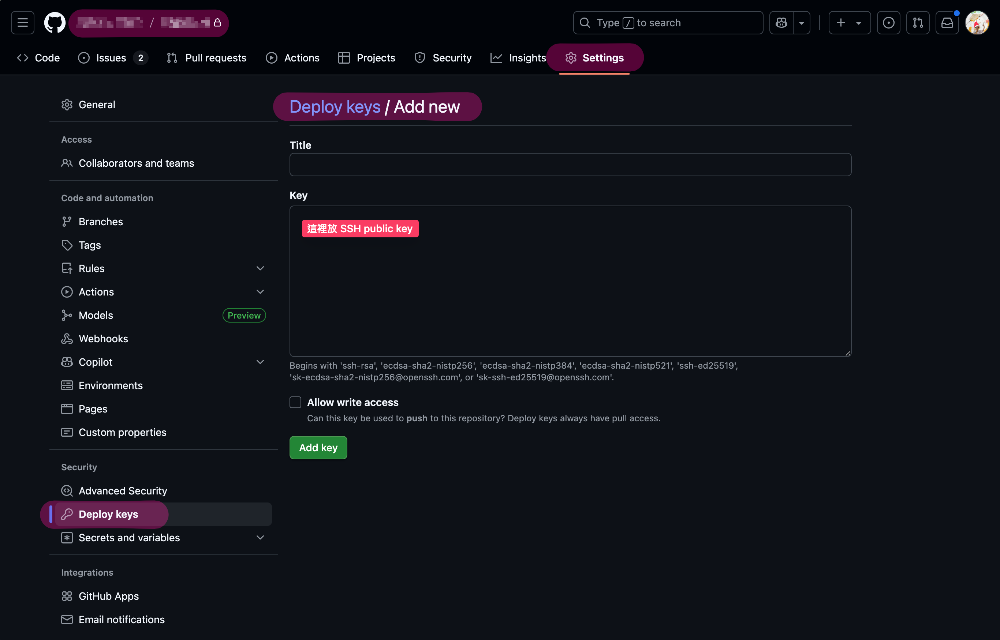
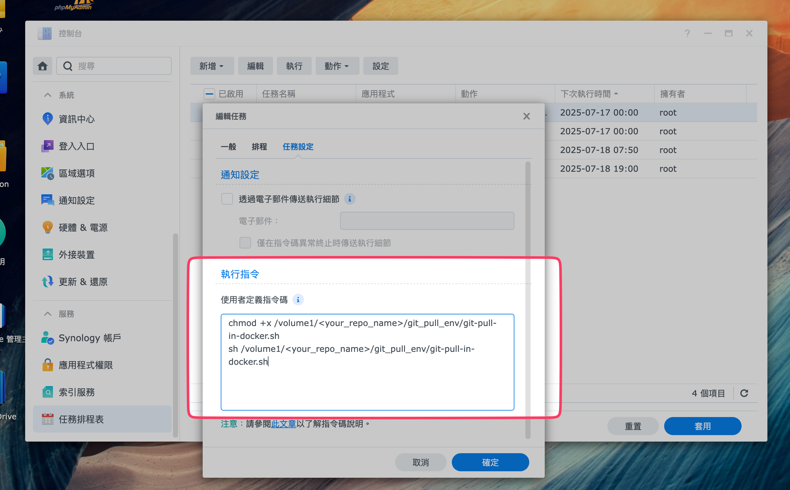
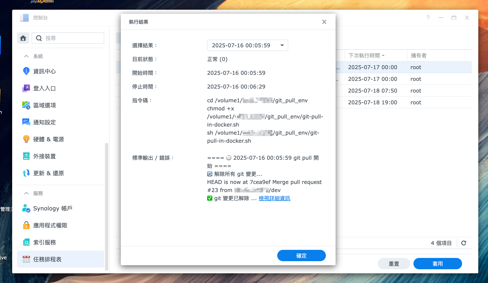

有些人想在自己的 Synology NAS 上架網站，並且讓程式碼能自動版本更新。如果在純 Linux 環境裡操作，這樣的需求不算太麻煩，通常可以搭配 crontab + git 來自動更新程式碼，就算是 Private Repository 也不是太大的問題。

不過如果想要在 Synology DSM （以下稱 DSM）上實作，由於 DSM 和終端預設沒有內建 Git CLI，除了套件中心不支援，自行安裝也需要擔心污染環境或被覆寫。除了直接把 code 手動放到專案目錄裡，我們要來用一些土炮的方式繞過這些限制。

這篇將示範：

* 使用 GitHub Deploy Key 進行權限驗證
* 使用 Docker container 執行 `git pull`
* 自動更新 repo 至指定資料夾
* 可整合 DSM 任務排程器定時執行

---

## 🧱 前置準備：建立資料夾結構

在 Synology 上建立以下目錄結構，將會用到的 SSH 設定檔、腳本等都放在這個資料夾裡。

請搭配 SSH 連線來操作在根目錄建立資料夾。

> 如果 SSH 連線的功能還沒啟用，請先到 Synology 的控制台 → 安全性 → 遠端存取 → 啟用遠端存取。

> volume1 是我這台 Synology 上的根目錄，如果你有其他選擇，你可以改成其他目錄，例如 /volume2/ 或 /volume3/。

```
/volume1/                           # 你的 NAS 根目錄，此處以 volume1 為例
└── <your_repo_name>/               # 你放專案 code 資料夾的名稱
    └── git_pull_env/               # Git 自動化執行環境
        ├── .ssh/                   # 存放 Deploy Key 與 ssh config
        ├── git-pull-in-docker.sh   # 用 Docker 執行 git pull 的腳本
        └── known_hosts             # 預設填入 github.com host key
```

---

## 🔐 步驟 1：產生 SSH Deploy Key

我們採用 SSH Deploy Key 的方式來部署，相較於使用 URL 搭配 access token，這種方式更為安全，能有效避免 token 在連線過程中被竊聽或盜用。

---

| 連線方式                                 | 優點                                                                                        | 缺點                                                                             | 適用情境                                                           |
| :--------------------------------------- | :------------------------------------------------------------------------------------------ | :------------------------------------------------------------------------------- | :----------------------------------------------------------------- |
| **HTTPS （搭配 Personal Access Token）** | **易於設定**：只需在 URL 中嵌入 access token 即可。                                         | **安全性較低**：token 在連線過程中可能被惡意程式碼或網路監聽竊取，存在外洩風險。 | **個人專案**或**非機密性**的部署環境。                             |
| **SSH （搭配 Deploy Key）**              | **安全性更高**：採用加密通訊協定，連線過程中不會傳輸任何憑證，有效避免 token 被竊聽或盜用。 | **設定步驟較為繁瑣**：需要產生 SSH 金鑰對並在 GitHub 專案中新增 Deploy Key。     | **正式部署環境**、**伺服器**或**需要嚴謹安全性**的自動化部署流程。 |

使用 SSH 連線至你的 NAS，在終端機執行以下指令。


```bash
mkdir -p /volume1/<your_repo_name>/git_pull_env/.ssh
ssh-keygen -t ed25519 -f /volume1/<your_repo_name>/git_pull_env/.ssh/id_ed25519 -C "<deploy>@<hostname>"
chmod 600 /volume1/<your_repo_name>/git_pull_env/.ssh/id_ed25519
```

第二條指令末端的 `<deploy>` 是為了方便辨識，可以改成其他名稱；`<hostname>` 則是你的 NAS 主機名稱，一樣可以改成其他名稱，例如 `deploy@yc_nas`。

---

## 📋 步驟 2：設定 SSH config

SSH config 的設定，指定使用我們剛剛產生的 Deploy Key，主要是為了讓 GitHub 認得這支有權限的身份，進而存取專案。

```bash
cat > /volume1/<your_repo_name>/git_pull_env/.ssh/config <<'EOF'
Host github.com
    HostName github.com
    User git
    IdentityFile /root/.ssh/id_ed25519
    IdentitiesOnly yes
EOF
chmod 600 /volume1/<your_repo_name>/git_pull_env/.ssh/config
```

---

## 🛡️ 步驟 3：手動填入 GitHub `known_hosts`

當我們用 SSH 去連 GitHub 拉原始碼時，系統會先檢查主機指紋（host fingerprint）來確保「你連的真的是 GitHub，而不是某個假冒的中間人」。這其實是避免 [中間人攻擊（MITM）](https://zh.wikipedia.org/zh-tw/%E4%B8%AD%E9%97%B4%E4%BA%BA%E6%94%BB%E5%87%BB) 的一種機制。

平常如果有安裝 `ssh-keyscan` 指令的話，我們可以用它自動把 GitHub 的主機金鑰加進 `known_hosts`。但在 DSM 上偏偏沒有這個工具，因此我們得「手動」把 GitHub 的主機指紋加進去。

可以到 GitHub 官方查詢他們目前的 [SSH 主機指紋](https://docs.github.com/en/authentication/keeping-your-account-and-data-secure/githubs-ssh-key-fingerprints)，然後手動把內容寫進 `~/.ssh/known_hosts` 裡，類似白名單的概念。

> 如果沒有做這個步驟，可能會遇到 `Host key verification failed` 的錯誤（我就遇到了 QQ）。

> 檔案權限 644 表示：
> * 檔案擁有者可以讀寫
> * 其他人只能讀

```bash
cat > /volume1/<your_repo_name>/git_pull_env/.ssh/known_hosts <<'EOF'
github.com ssh-ed25519 AAAAC3NzaC1lZDI1NTE5AAAAIOMqqnkVzrm0SdG6UOoqKLsabgH5C9okWi0dh2l9GKJl
github.com ecdsa-sha2-nistp256 AAAAE2VjZHNhLXNoYTItbmlzdHAyNTYAAAAIbmlzdHAyNTYAAABBBEmKSENjQEezOmxkZMy7opKgwFB9nkt5YRrYMjNuG5N87uRgg6CLrbo5wAdT/y6v0mKV0U2w0WZ2YB/++Tpockg=
github.com ssh-rsa AAAAB3NzaC1yc2EAAAADAQABAAABgQCj7ndNxQowgcQnjshcLrqPEiiphnt+VTTvDP6mHBL9j1aNUkY4Ue1gvwnGLVlOhGeYrnZaMgRK6+PKCUXaDbC7qtbW8gIkhL7aGCsOr/C56SJMy/BCZfxd1nWzAOxSDPgVsmerOBYfNqltV9/hWCqBywINIR+5dIg6JTJ72pcEpEjcYgXkE2YEFXV1JHnsKgbLWNlhScqb2UmyRkQyytRLtL+38TGxkxCflmO+5Z8CSSNY7GidjMIZ7Q4zMjA2n1nGrlTDkzwDCsw+wqFPGQA179cnfGWOWRVruj16z6XyvxvjJwbz0wQZ75XK5tKSb7FNyeIEs4TT4jk+S4dhPeAUC5y+bDYirYgM4GC7uEnztnZyaVWQ7B381AK4Qdrwt51ZqExKbQpTUNn+EjqoTwvqNj4kqx5QUCI0ThS/YkOxJCXmPUWZbhjpCg56i+2aB6CmK2JGhn57K5mj0MNdBXA4/WnwH6XoPWJzK5Nyu2zB3nAZp+S5hpQs+p1vN1/wsjk=
EOF
chmod 644 /volume1/<your_repo_name>/git_pull_env/.ssh/known_hosts
```

---

## 🌐 步驟 4：將公鑰加入 GitHub Deploy Key

1. 執行查看公鑰指令，複製回傳的文字（你的公鑰）：

   ```bash
   cat /volume1/<your_repo_name>/git_pull_env/.ssh/id_ed25519.pub
   ```

2. 複製文字並貼上到：

   → GitHub Repository → Settings → Deploy Keys → Add Key
   → 允許 **Read-only** 即可



---

## 🧪 步驟 5：準備專案目錄

選定你放置專案的路徑，我們先記錄起來，例如：

```
/volume1/docker/<your_repo_name>
```

---

## 🐳 步驟 6：製作 `git-pull-in-docker.sh` 腳本（用 Docker 執行）

你可能會想，為什麼不直接使用 `git pull` 來更新專案？

這是因為 DSM 預設沒有內建 Git CLI，而套件中心裡的 Git Server 套件也只支援 Git 託管（hosting）功能，不包含 `git pull` 這類的客戶端（client）指令。因此，要用原生方式完成我們的需求幾乎不可能。

加上這台機器是客戶的，不能使用 CLI 安裝 Git，以免「污染環境」，所以我們可以考慮利用 Docker 建立一個可控且獨立的環境來執行 Git 指令。

**我們選擇 `alpine/git` 這個映像檔（image），並將專案目錄掛載到 Docker 容器中，就能正常使用 `git pull` 指令來更新專案了。**

> 本文所使用的 Docker 是 Synology 的 Docker 套件（Container Manager），若你在其他環境操作，請自行調整。

在終端機執行以下的指令，建立一個 `git-pull-in-docker.sh` 腳本，這個腳本會用 Docker 執行 `git pull` 指令來更新專案。

```bash
cat > /volume1/<your_repo_name>/git_pull_env/git-pull-in-docker.sh <<'EOF'
#!/bin/bash
set -euo pipefail

echo "==== 🕒 $(date '+%F %T') git pull 開始 ===="

REPO_DIR="/volume1/docker/<your_repo_name>"
SSH_PATH="/volume1/<your_repo_name>/git_pull_env/.ssh"
GIT_SSH="ssh -i /root/.ssh/id_ed25519 -F /root/.ssh/config"

# 確認 .git 是否存在
if [ ! -d "$REPO_DIR/.git" ]; then
  echo "❌ 找不到 .git，這不是一個 Git repo"
  exit 1
fi

# Docker 執行 git pull
docker run --rm \
  -v "$REPO_DIR":/repo \
  -v "$SSH_PATH/id_ed25519":/root/.ssh/id_ed25519:ro \
  -v "$SSH_PATH/config":/root/.ssh/config:ro \
  -v "$SSH_PATH/known_hosts":/root/.ssh/known_hosts:ro \
  -e GIT_SSH_COMMAND="$GIT_SSH" \
  alpine/git \
  -C /repo pull origin main

echo "✅ git pull 完成"
EOF
chmod +x /volume1/<your_repo_name>/git_pull_env/git-pull-in-docker.sh
```

---

## 🧪 步驟 7：測試執行

在還開著的終端機執行：

```bash
sh /volume1/<your_repo_name>/git_pull_env/git-pull-in-docker.sh
```

你應該會看到以下執行結果：

```
==== 2025-07-15 21:00:00 git pull 開始 ====
Already up to date.
✅ git pull 完成
```

---

## 🗓️ 步驟 8：設定 DSM 任務排程器

通常在 Linux Server 上，我們直接操作 `crontab` 來設定定時任務，不過在 DSM 上，我們可以使用「任務排程器」來設定定時任務，會更加地原生，避免權限或覆寫衝突等錯誤。

~~謎之音：我也很怕在套皮的系統底層改一改就爆了。~~

* 前往 DSM → **控制台 → 任務排程器**
* 新增「使用者定義的腳本」
* 使用者選擇 `root`
* 指令填入：

```bash
chmod +x /volume1/<your_repo_name>/git_pull_env/git-pull-in-docker.sh
sh /volume1/<your_repo_name>/git_pull_env/git-pull-in-docker.sh
```
* 設定為每天 / 每小時執行即可。

之所以選擇 `root` 使用者，是只有最高權限的使用者可以存取 Docker daemon，進而操作 Docker Image 和 Container 容器。

> 如果你的帳號擁有最高權限，在介面要求輸入 root 密碼時，你可以輸入當下使用者的密碼。




透過介面執行一次剛剛新增的任務後，即可看到執行的 log，確認是否成功。



---

## ✅ 小結：成果總覽

| 元件                    | 功能                                  |
| ----------------------- | ------------------------------------- |
| `id_ed25519`            | GitHub Deploy Key（私鑰）             |
| `config`                | SSH 設定，指定使用 Deploy Key         |
| `known_hosts`           | 預先信任 GitHub Host key，避免卡互動  |
| `git-pull-in-docker.sh` | 用 Docker + git image 執行 `git pull` |
| `DSM 任務排程器`        | 定時執行自動更新，以及以              |

---

## 📒 參考資料

- [Connecting to GitHub with SSH - GitHub Docs](https://docs.github.com/en/authentication/connecting-to-github-with-ssh)
- [Git Server - Synology 知識中心](https://kb.synology.com/zh-hk/DSM/help/Git/git?version=7)
- [SSH Key Authentication on Synology - Reddit](https://www.reddit.com/r/synology/comments/12drqpz/ssh_key_authentication_on_synology/)
- [在群暉 Synology NAS DSM7.0 上安裝套件管理器](https://natlee.github.io/Blog/posts/53cbcaf3/)


這篇文章與程式碼使用 ChatGPT 和 Claude-4-sonnet by Cursor 輔助撰寫。