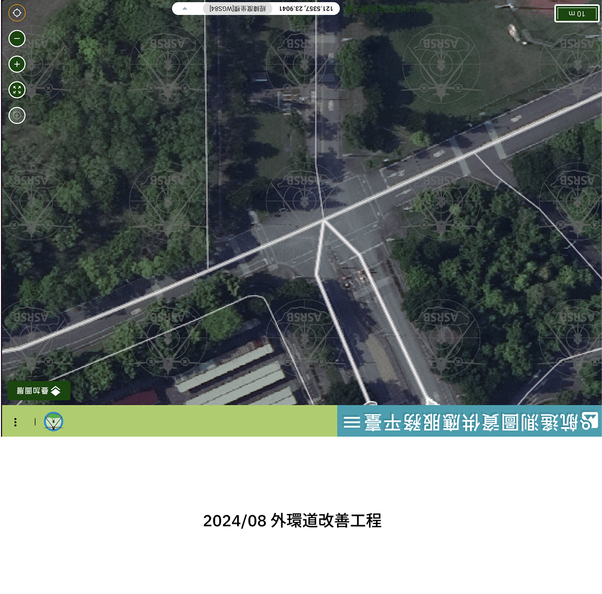
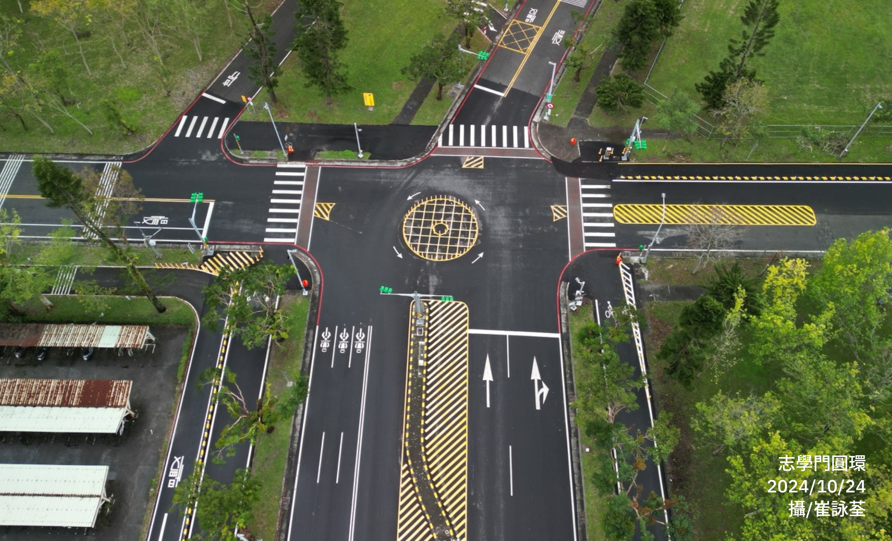
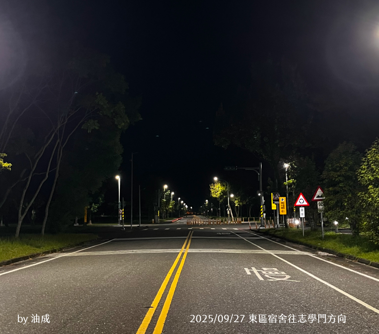
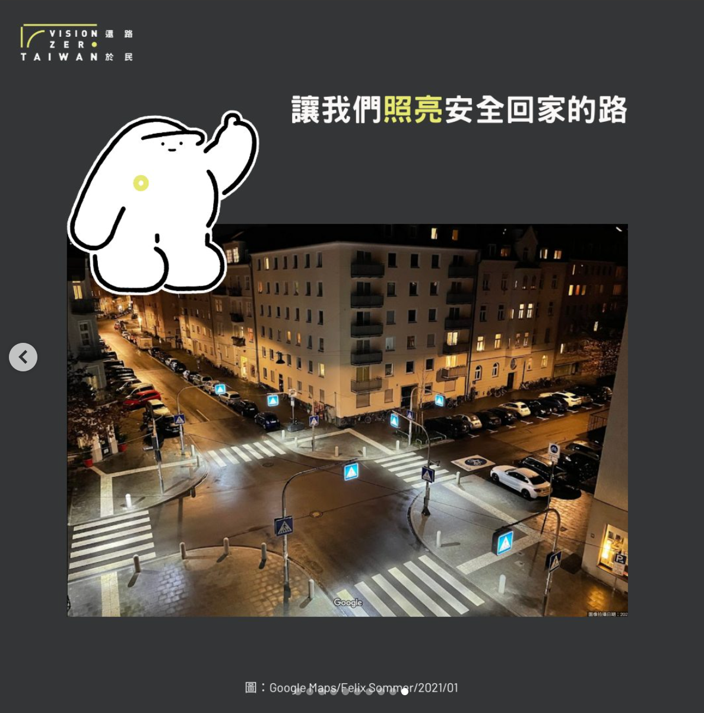
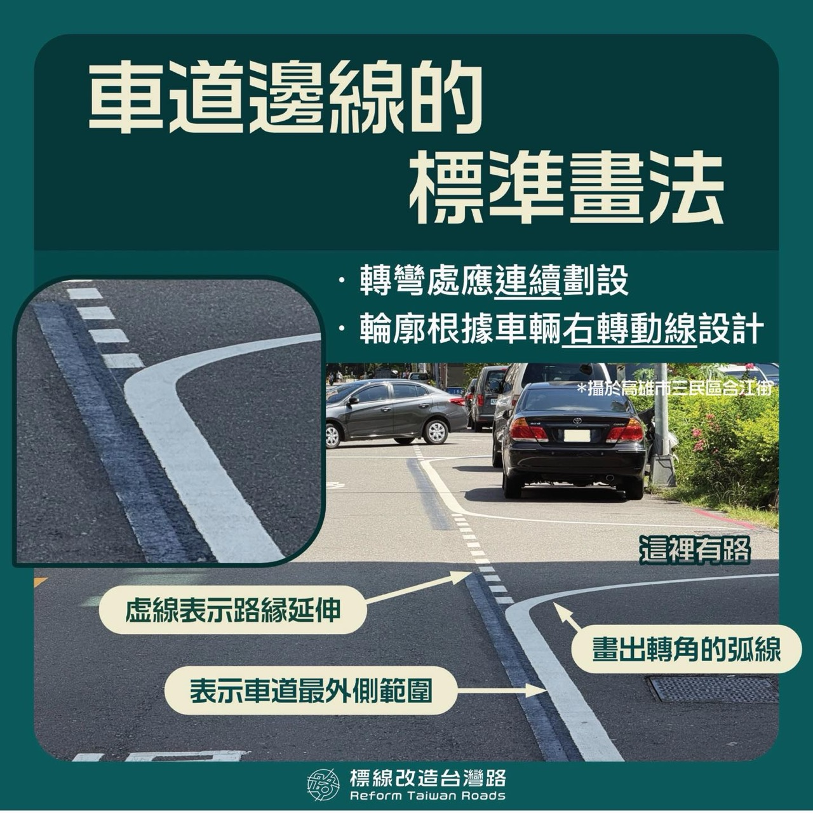
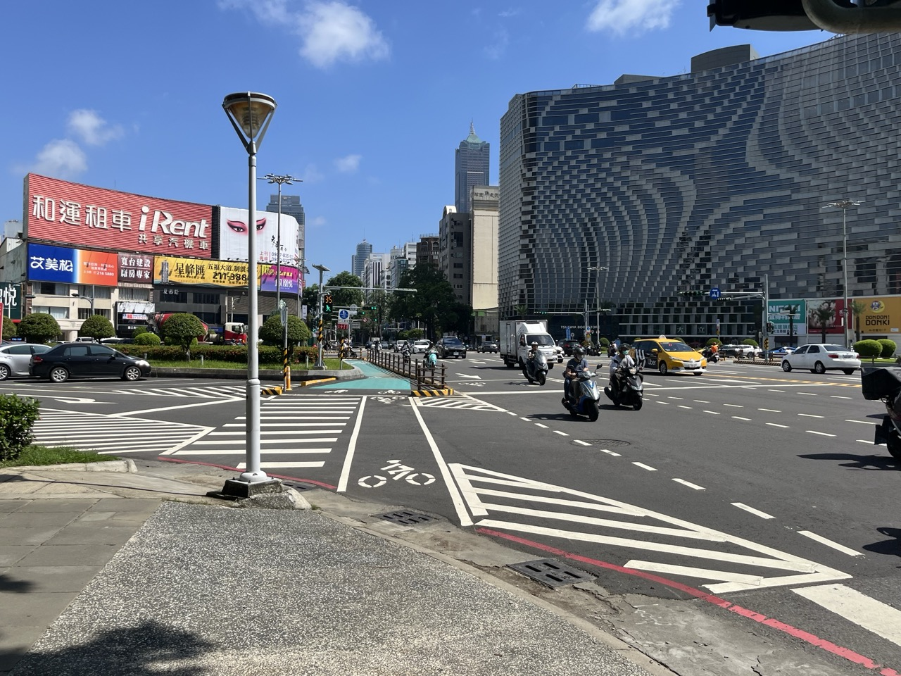
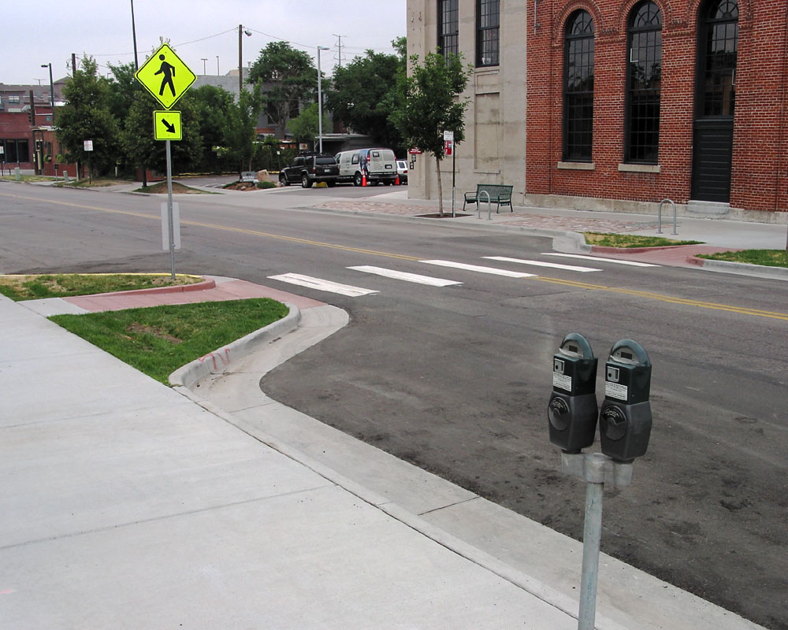
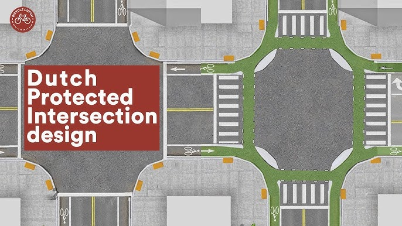

東華在 2024 年 11 月竣工的圓環啟用快一週年了，一些如[公館圓環](https://youtu.be/HltUC0HLH4Y)動線不明確的問題逐漸浮出檯面，加上[中山大學校內啟用「新型標線圓環」](https://news.nsysu.edu.tw/p/406-1120-360982,r3979.php?Lang=zh-tw)，能看到完整設計的圓環座落在校園中，我很是羨慕。因此我也想提一些關於圓環的標線改善提案，不知道這學期有沒有機會推成呢？

<!--more-->

# 志學門圓環分析

## 現況

志學門圓環是「2024/11 外環道整體規劃改善工程（第一期）」的一部分。這個圓環位於東華大學志學門入口處，連接校內外環道與校內道路，使用角色包含行人、自行車、機車與汽車等多種交通工具，尖峰時段進出校車輛的流量非常可觀。

原正交路口空照圖來自於[「航遙測圖資供應服務平臺」](https://gis.asrs.gov.tw/atisweb/@121.53637961728539,23.903666423513613,20.00z)。

## 改善提案



* **讓路提示更明確**：在左方來車之行穿線前調整為「讓路線」；環道以「白色短虛線」清楚描出圓環邊界，提供車輛判斷他向來車進入圓環與否。
* **自行車道銜接至人行道**：此處分為兩個狀況，一為左方來車方向，自行車動線通常會右轉上人行道；二為現行行人與自行車通過路口時，需要一次穿越兩個車道，因此將自行車道直接銜接至人行道，可以避免行人於道路上暴露的時間，並且擴大人行道範圍。
* **視距/減速提醒**：左方來車方向，加強行穿線照明，並且於路燈桿上設置「注意行人」警示牌，表示提醒此處有行人通過，提醒駕駛注意行人、進環車減速。
* **人行/單車導引**：四周人行道空間補上「**藍底行人、自行車共用道指示牌**」，表示該處為自行車也可以使用的空間；補足與擴大右上角與左下角破碎的人行道範圍（水溝蓋銜接處），方便行人/單車駐留通行。
* **行穿線導流、禁止跨雙黃線左轉**：
  * 左側來車，雙黃線處加一排**防撞桿**，進行實體阻隔。
  * 左側行穿線處，需要處理高流量人與車，除了有來自上方內環出入的自行車與行人，同時行人也要面對來自左方機動車輛，因此此處升級為歐式導流標線，兩處導流帶間則為行人停等空間；
* **車道方向指向線**：下方入校來車之內側車道，調整為「直行/左轉方向箭頭」，表示進環靠內側。

# 一些靈感來源

從改善清單來看，很明顯大多是為了處理左方來車（東區宿舍）與自行車行人穿越需求，複雜的穿越需求，實在需要好好設計一番，調整靈感來自於：

## 歐式行人穿越庇護島

歐式行人穿越，盡可能將行人穿越途徑切割成小段小段的，並且加強分隔段的示警，確保行人通行安全，駕駛也能更清楚判斷行人動向。

### 路口與穿越處實景與分析

老實說，體驗過一次就回不去了，這東西對行人真的很友善，不需要面對一次橫越多車道的車流

> 成人一秒可以走約 1.2 公尺，兒童約 0.9 公尺，假設行人穿越道寬度為 6 公尺，成人約需 5 秒、兒童約需 7 秒可通過。若一次要橫越兩個車道，則需要 10 秒（成人）或 14 秒（兒童），這段時間對於行人來說是很長的等待與暴露時間。

如果像歐式這種分段行人穿越道的設計，一次只需要面對一個方向的車流，甚至只需要穿越一個車道，等待時間減半，並且中間有庇護島可以暫時停留，能大幅降低行人穿越的壓力與危險程度。

第一個分享的是「荷蘭阿姆斯特丹南區」的行人穿越道，這個路口位於商業區 Zuidas，附近有許多金融機構、辦公大樓、商店與大眾運輸停靠站，旁邊正是 Vrije Universiteit 呢！行人也是流量相當可觀。



第二個分享的是稍微北一點的路中段的行人穿越道，這裡有路面電車停靠站，行人可以自由穿越。

我覺得厲害的地方就在於，明明那條路是城市幹道或二級道路，但這條道路分配給雙向一車道、一條公車專用道、路中的路面電車，以及臺灣很缺的人行道，行人與車輛使用起來卻不會感到壓力。

相較臺灣寬大的柏油馬路，這裡設計得很有禮貌，讓駕駛在經過路口、行穿線時自然願意放慢速度禮讓行人。如果相同場景在臺灣，絕對是插一組紅綠燈處理穿越的橫斷人流吧！xd





第三個是「布魯塞爾自由大學」附近的行人穿越道，同樣也是採用「分段式行穿線」的設計，讓行人可以分段通過兩個車道，並且在中間有一個安全島可以暫時停留。

Guess what? 這是 N24 主要幹道，類似於臺灣的省道等級，車流量相當可觀，卻能做到這種人本設計，我真的好佩服。



### 分段行人穿越道文獻
https://www.tandfonline.com/doi/full/10.1080/01944363.2024.2394610 （圖一）

近期臺北市復興南路一段與忠孝東路三段（捷運忠孝復興站出來）路口，新做的
https://therantyhighwayman.blogspot.com/2022/08/
https://maps.app.goo.gl/4uk22m1qCucAtzkH6 （圖二）

## 燈光照明

燈光照明真的太重要了 QQQQ，尤其從新宿方向過來的自行車、內環出校自行車及行人仰賴這側的行穿線，更應該提升其安全。
目前的日光燈根本不足以照亮路口，甚至接近時才得以觀察到行人與自行車動線，以及圓環位置。

圖三：接近圓環於夜間之狀況

[🔍 高解析度照片](/ndhu-zhixue-roundabout-v2/view-from-east-dorm-to-zhixue-gate@2x.jpg)

https://www.instagram.com/p/DE_jOjosnbM/?img_index=10 （圖四）

## 連續的車道邊線

前陣子去臺南開車的時候注意到主要道路上基本上都做了這個設計，高雄近期在大立五福圓環新設計時也加入這種做法。
https://www.facebook.com/photo/?fbid=1425058789144271&set=a.601575628159262

有助於駕駛判斷車道範圍及路口位置，支道讓路停等時也有邊線作為第二次停車位置的依據。

我很喜歡！

## 「胖胖人行道」與「荷蘭式路口」

胖胖人行道的概念也可以加入討論，但目前看起來圓環周遭沒有多餘的路肩，所以應該加不進來（？

自行車道的動線則直接整併到人行道上，走一個荷蘭式慢車道的概念，讓道路對自行車友善一點

https://www.planetizen.com/definition/traffic-calming 圖一
https://nacto.org/publication/urban-street-design-guide/street-design-elements/curb-extensions/

https://www.youtube.com/watch?v=FlApbxLz6pA 圖二

圖三 五福大立圓環

# 參考資料

東華志學門圓環
- [國立東華大學 113-1 第一次校務會議 總務處業務報告 - Page20 記載「志學門及西側外環道路改善工程」時程](https://secret.ndhu.edu.tw/var/file/11/1011/attach/56/pta_135347_6205732_01097.pdf)
- [外環道整體規劃改善公開說明會（第一期）](https://announce.ndhu.edu.tw/mail_display.php?timestamp=1703067001)
- [2023 東華學生會 外環會勘成果報告](https://dhsa.ndhu.edu.tw/p/404-1110-208910.php?Lang=zh-tw)
- [110 年車輛管理委員會 - 學生會提案「」 - 附件七](https://ga.ndhu.edu.tw/var/file/6/1006/img/1710/494000433.pdf)
- [Dcard 東華大學版 後門圓環走法](https://www.dcard.tw/f/ndhu/p/256586275)
- [東華學生會 可以期許一條更安全的路嗎？──外環道整建審查會議紀錄](https://www.instagram.com/p/C0jeCdghaHG/)
- [東華學生會 校園交通安全提醒](https://www.facebook.com/NDHUStudentAssociation/posts/%E4%BA%A4%E9%80%9A%E5%AE%89%E5%85%A8%E6%8F%90%E9%86%92%E4%B8%8D%E8%AB%96%E4%BD%A0%E6%98%AF%E5%89%9B%E5%85%A5%E5%AD%B8%E7%9A%84%E6%96%B0%E7%94%9F%E7%86%9F%E6%82%89%E6%A0%A1%E5%9C%92%E7%9A%84%E8%88%8A%E7%94%9F%E6%88%96%E6%98%AF%E9%82%84%E5%9C%A8%E9%81%A9%E6%87%89%E6%9D%B1%E8%8F%AF%E4%BA%A4%E9%80%9A%E7%92%B0%E5%A2%83%E7%9A%84%E5%90%8C%E5%AD%B8%E4%BA%86%E8%A7%A3%E4%B8%A6%E9%81%B5%E5%AE%88%E6%AD%A3%E7%A2%BA%E7%9A%84%E8%A1%8C%E8%BB%8A%E6%96%B9%E5%BC%8F%E5%B0%8D%E6%AF%8F%E4%B8%80%E4%BD%8D%E7%94%A8%E8%B7%AF%E4%BA%BA%E9%83%BD%E8%87%B3%E9%97%9C%E9%87%8D%E8%A6%81%E6%8F%90%E9%86%92%E5%90%8C%E5%AD%B8%E5%80%91%E5%9C%A8%E9%80%9A%E8%A1%8C%E6%99%82%E5%8B%99%E5%BF%85%E6%B3%A8%E6%84%8F%E4%BB%A5%E4%B8%8B%E4%BA%8B%E9%A0%85%E7%A2%BA/1308705074597793/)
- [東華新設圓環引爭議　校方加強宣導盼減少事故 NCCU 大學報](https://unews.nccu.edu.tw/unews/%E6%9D%B1%E8%8F%AF%E5%A4%A7%E5%AD%B8%E5%BE%8C%E9%96%80%E6%96%B0%E5%A2%9E%E5%9C%93%E7%92%B0%E5%AD%B8%E7%94%9F%E6%86%82%E4%BA%8B%E6%95%85%E7%8E%87%E4%B8%8A%E5%8D%87%E9%97%9C)
- [Dcard 東華大學版 \[什麼東東\]志學門行人號誌及圓環啟用](https://www.dcard.tw/f/ndhu/p/256591103)
- [東華學生會與學務處合辦標線改造工作坊圓滿落幕](https://www.ndhu.edu.tw/p/406-1000-226232,r4956.php?Lang=zh-tw)

- https://courses.planetizen.com/course/urban-design-planners-streetscape-design
- [導入參與式設計　中山大學啟用新型標線圓環](https://news.nsysu.edu.tw/p/406-1120-360982,r3979.php?Lang=zh-tw)
- [FHWA / MUTCD（美國交通控制手冊） LESSON 8: PEDESTRIAN CHARACTERISTICS](https://www.fhwa.dot.gov/publications/research/safety/pedbike/05085/chapt8.cfm)