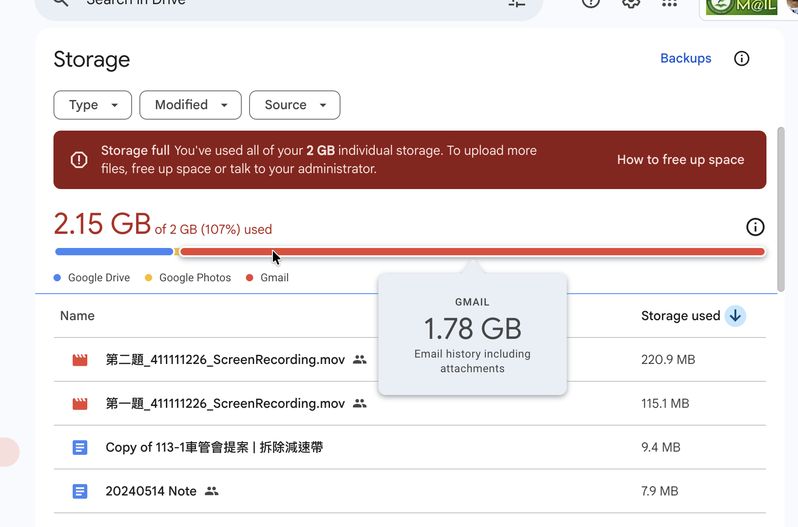

哭啊！學校信箱又爆了。<!--more-->這次不忍了，來寫個 Google Apps Script 自動清理舊信件的 script。
（拜託學校別再寄不緊急又大包附件的~~公告~~垃圾信到信箱了😭，學生只有 2GB 可以用RRRR）



# 使用方式

懶人包，造福跟我一樣每天被學校信件淹沒的同學們：

1. 打開 [Google Apps Script 編輯器](https://script.google.com/)。
2. 建立一個新的專案，將以下程式碼貼上並儲存。
3. 修改 `SENDERS` 列表，加入你想要移除的目標寄件者電子郵件地址，例如學校的 `announce@gms.ndhu.edu.tw`。
4. 執行 `purgeOldMailsDynamic` 函式，第一次建議將 `DRY_RUN` 參數設為 `true`，以確認將刪除的信件數量。
5. 確認執行效果後，將 `DRY_RUN` 改為 `false`，再次執行以實際刪除舊信件。

如果想將這個腳本自動化，可以執行 `createTrigger` 函式，預設每 15 天自動執行一次清理任務。

```javascript
/**
 * 指定寄件者只保留一個月內的信件，其餘移到垃圾桶。
 * 以當下時間 now 為基準，每次執行都重新計算「一個月以前」。
 * 建議配合時間驅動觸發器（每 15 天自動執行）。
 */
function purgeOldMailsDynamic() {
  const SENDERS = [
    'announce@gms.ndhu.edu.tw',
    'elearn@gms.ndhu.edu.tw',
    'noreply-apps-scripts-notifications@google.com',
    // 'gms.ndhu.edu.tw' 整個網域。注意，取消「//」兩條斜線後，代表啟用這個條件。這條設定會刪除所有來自 @gms.ndhu.edu.tw 寄來的信件！例如教授、同學、系辦、全校公告信等，都在被丟到垃圾桶的範圍內，請小心使用。
  ];
  const KEEP_DAYS = 30; // 一個月
  const DRY_RUN = true;  // 先試跑，確認無誤再改成 false
  const BATCH = 500;     // GmailApp.search 每次最多 500 threads

  // 推算一個月以前的日期
  const now = new Date();
  const cutoff = new Date(now.getTime() - KEEP_DAYS * 24 * 60 * 60 * 1000);

  // 動態生成查詢：一個月內（保留區） vs 一個月以前（刪除區）
  const senderQuery = SENDERS.map(s => `from:(${s})`).join(' OR ');
  const query = `(${senderQuery}) -in:spam -in:trash`;
  let start = 0;
  let totalThreads = 0, totalMsgs = 0, kept = 0, trashed = 0;

  console.log(`執行時間：${now}`);
  console.log(`保留範圍：${cutoff.toISOString()} 之後`);

  while (true) {
    const threads = GmailApp.search(query, start, BATCH);
    if (!threads.length) break;
    totalThreads += threads.length;

    threads.forEach(thread => {
      const messages = thread.getMessages();
      totalMsgs += messages.length;

      messages.forEach(msg => {
        const date = msg.getDate();
        if (date >= cutoff) {
          kept++;
        } else {
          trashed++;
          if (!DRY_RUN) GmailApp.moveMessageToTrash(msg);
        }
      });
    });

    start += threads.length;
    if (threads.length < BATCH) break;
  }

  console.log(`=== 結果（DRY_RUN=${DRY_RUN}）===`);
  console.log(`處理信件串：${totalThreads}`);
  console.log(`訊息總數：${totalMsgs}`);
  console.log(`保留一個月內：${kept}`);
  console.log(`丟到垃圾桶：${trashed}`);
}

/**
 * 可選：建立時間驅動觸發器
 * 每半個月（15天）自動執行一次 purgeOldMailsDynamic()
 */
function createTrigger() {
  // 刪除舊觸發器，避免重複
  ScriptApp.getProjectTriggers().forEach(t => {
    if (t.getHandlerFunction() === 'purgeOldMailsDynamic') ScriptApp.deleteTrigger(t);
  });

  // 新增一個每15天執行一次的觸發器
  ScriptApp.newTrigger('purgeOldMailsDynamic')
    .timeBased()
    .everyDays(15)
    .create();

  console.log('已設定每半月自動執行一次。');
}
```